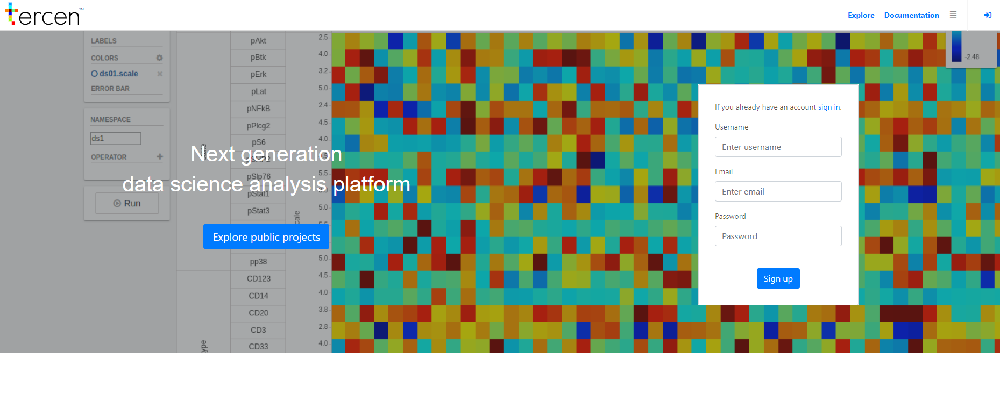

# Signing up
In this section you will create an account for __Tercen__ 
We highly recommend using __google chrome__ while using __Tercen Cloud__.

* Go to https://Tercen.com

* Create an account by filling in the:
  * Username
  * Email
  * Password
  

You have now created an account.

* Verify your account by clicking the link in the email we sent you

You have a verified account now. \
The next step is signing in using your newly created account.
