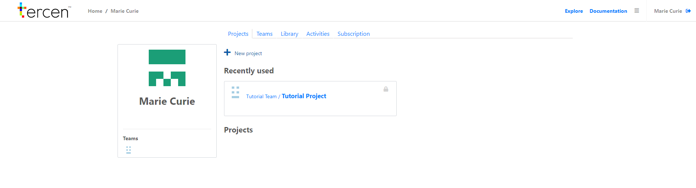

# Sign in
In this section you logging into the __Tercen cloud__.

* Click on the verification email for your Tercen account\
Or
* Go to https://Tercen.com and click on  `Sign in`

\ 

You should now see the sign in menu
 

\ 

* Enter your username and password

\ 

* Click on `Sign in`

You should see the the homepage of your account, similar to the image below.
\ 

You are now signed in to the __Tercen cloud__.
In the next section you can decide to use our preloaded data or create your own.