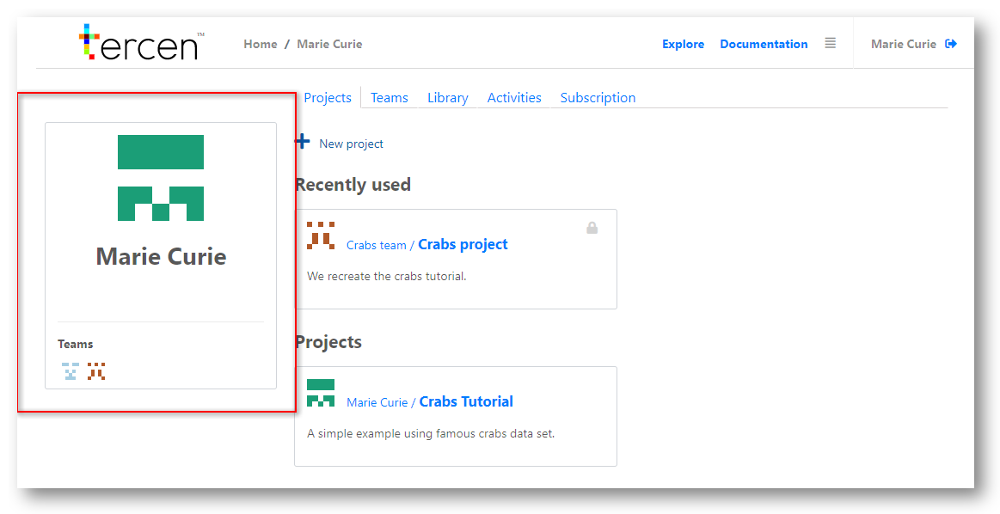

# Navigate your personal page

In this section we give an overview of your personal home page.

\

Your home page has three sections.

* Header Bar
* Team Icons
* Project Area

## Header bar {-}

\

All parts of the header bar are actionable by clicking on them.

\

\

1. Click the __Tercen__ logo to return to your home page at any time.

\

2. A pathway shows your current location. 

     It will change as you navigate through the system. 
     
     To jump to a section, just click on it.

\

3. Click `Explore` to enter the community section of __Tercen__.
     Publicly available projects are found here. 

\

4. User documentation. You will find user manuals and resources for programmers linked here.

\

5. Information icon.

     `Resource` shows how much CPU and Storage you have used on projects so far. 
     
     It will show how the computing resources still available on your subscription.
     
     `About` gives information on the current version of the software.

\

6. Exit - Sign out of __Tercen__ here.

\

\

## Team icons {-}

\

In __Tercen__ you are always working in a team. 
Even if it is a team of just one person, like your personal page.

Teams have members and  projects. Projects have data, work-flows, and documentation. 

__Tercen__ assigns an icon to a team when it is created. You were assigned the large icon for your personal account. Icons exist to to help you identify which team you are working for at any time.

The smaller icons at the bottom of the section show the teams you are member of.

\

Click a small icon go to a Team page and see all of the projects that team is working on.

\

\

\

## Project area {-}

\

This is the core area of __Tercen__. When you sign-in this page will default to your personal projects. 

To work on a project owned by one of your teams, click the icon and view the Team page.

\

At the top of the project area you will see the following tabs:\

  * `Projects`\
  * `Teams`\
  * `Library`\
  * `Activities`\
  * `Subscription`\
  
\

__Projects__

\

\

Click the `plus button` to create a new project. This is described in Chapter 8. "Create a new project"

\

Under __Recently used__ the last four projects you accessed will be visible to click for a quick return.

\

Your personal projects are listed under __Projects__. team projects are not shown here. 

\

__Teams__

\

In this section clicking the icon of a team will take you to that teams project page.

\

Add a team with the `plus button` or delete a team by clicking on the bin that appears underneath its icon.

\

Creating teams is explained in Chapter 6 "Define a Team".

\

__Library__

\

In this section you can add Mathematical Operators or Apps to be  available for use in the workflows of your personal projects.

\

See Chapter 7. "Add apps to a library".

\

__Activities__

\

A log of activity on your personal projects is kept here.By clicking on the link you can jump to the area of interest.

\

__Subscription__

\

Here you will see the details of your subscription.

\

You can upgrade or cancel your subscription. Or change your payment method.

\

\

__Next...__ learn how to explore public projects.
