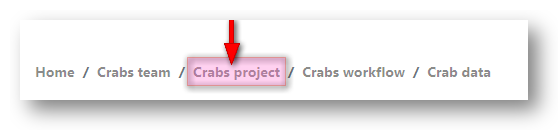
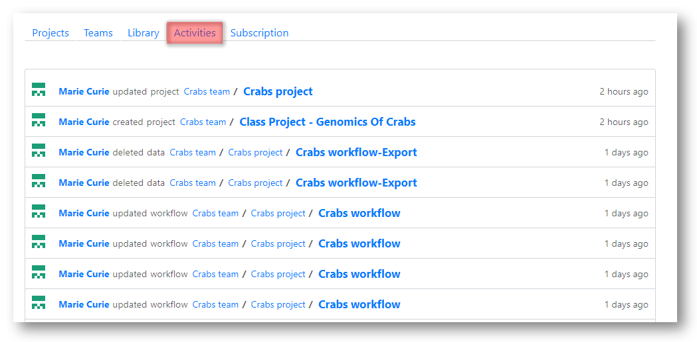
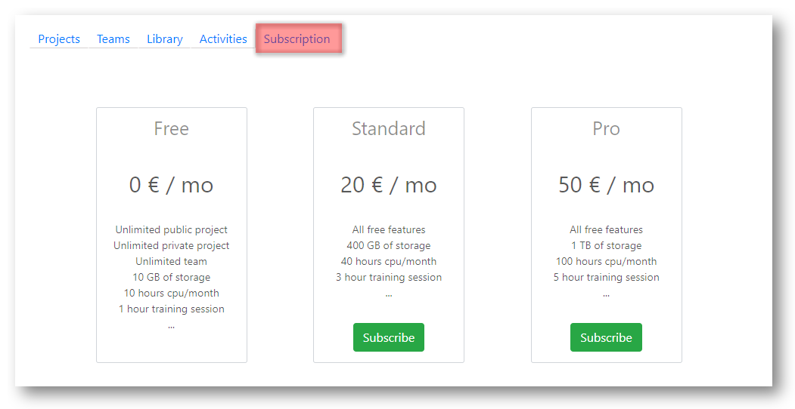

# Navigate your personal page

In this section we give an overview of your personal home page.

Your home page has three sections.

* Header Bar
* Team Icons
* Project Area

\

## Header bar {-}

\

All parts of the header bar are actionable by clicking on them.
\

\

* 1. Click the __Tercen__ logo to return to your home page at any time.

\

* 2. A pathway shows your current location. 

     It will change as you navigate through the system. 
     
     To jump to a section just click on it.

\

* 3. Click `Explore` to enter the community section of __Tercen__.
     Publicly available projects are found here. 

\

* 4. User documentation. You will find user manuals and resources for programmers linked here.

\

* 5. Information icon.

     `Resource` shows how much CPU and Storage you have used on projects so far. 
     
     It will show how the computing resources still available on your subscription.
     
     `About` gives information on the current version of the software.

\

* 6. Exit - Sign out of __Tercen__ here.

\

\

## Team icons {-}

In __Tercen__ you are always working in a team. Even if it is a team of just one person like your personal page.

Teams have members and  projects. Projects have data, work-flows, and documentation. 

__Tercen__ assigns an icon to a team when it is created. You were assigned this large icon for your personal account. The icons are there to help you identify which team you are working for at any time.

The small icons show the teams you are member of.

Click the small icons at the bottom of the section go to the Team Page and see all of the projects that team is working on.

\

\

\

## Project area {-}

\

\

This is the core area of working in __Tercen__. When you sign-in this page will default to your personal projects. To work on a project owned by one of your teams, click the icon to view the teams page.

At the top of this section you will see the following tabs:\

  * `Projects`\
  * `Teams`\
  * `Library`\
  * `Activities`\
  * `Subscription`\

\

Click the `plus button` to create a new project. This is described in Chapter 6. Creating New Projects

\

Under `Recently used` the last four projects you accessed will be visible here for a quick return to them.

\

Your Personal Projects are listed under `Projects`. 

\

Clicking the icon of one of your teams will take you to that teams project page.

Add a team with the `plus button` or delete a team by clicking on the bin that appears underneath its icon.

Creating teams is explained in Chapter 7 Working with teams.

\

In this section you can add Mathematical Operators or Apps to make them available for use in the work-flows of your personal projects.

See section 8. Adding Operaors to a project.

\

A log of your activity on your personal projects is kept here.By clicking on the link you can jump to the area of interest.

\

Here you will see the details of your Subscription.

You can upgrade or cancel your subscription or change your payment method.

\

\

In the next section you learn how to __Explore__ public projects.
