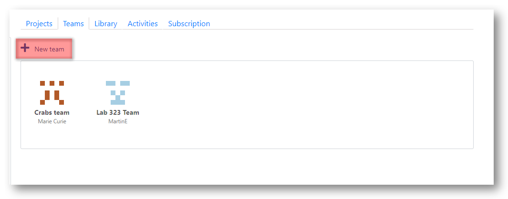
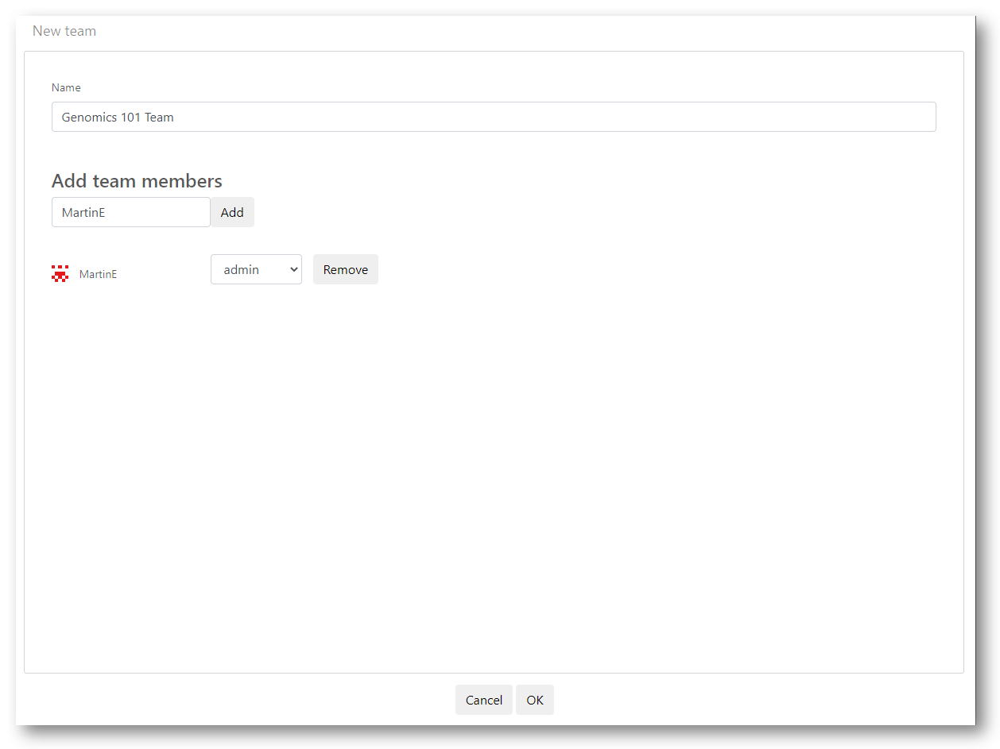
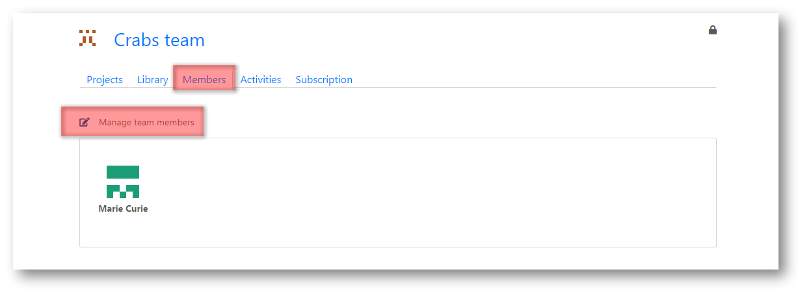

# Define a team

Teams are an important concept in __Tercen__. Researchers are members of a team and as part of the team they create and own projects. 

\

Teams have the following characteristics. 

* A team is created by a user.
* The creator is the Administrator of the team.
* Teams are composed of members.
* Users can be members of many teams.
* Teams own a Library of Apps and a set Projects they are applied to
* Members have access permissions to control how they affect the things the team owns.

\

In __Tercen__ you always work in a team. Even if it is just a single member of your personal team.

\

To create a team select the __Teams__ tab on your personal home page. 

\

\

Press the `New Team` button.

\

Configure the team on the administration page.

\

\

* Name the team

* Enter the user-name of any person you want to add to the team.

* Select their access permissions.

`Read`        - Can view and clone projects\
`Read Write`  - Can modify projects, such as adding operators to work-flows\
`Admin`       - Can add and remove users to the team and change their permissions\

\

Click the `Ok` button to save your configuration.

\

__Modifying Teams__

\

A Teams membership can be modified at later stage. 

To do this, access the Team page by clicking its icon.

\

\

Select the `Members` tab

\

Click the `Manage team members` link

\

\

Now you can Add and Remove team members, or change their access permissions.

\

\

__Next__... Add an app to your Library.