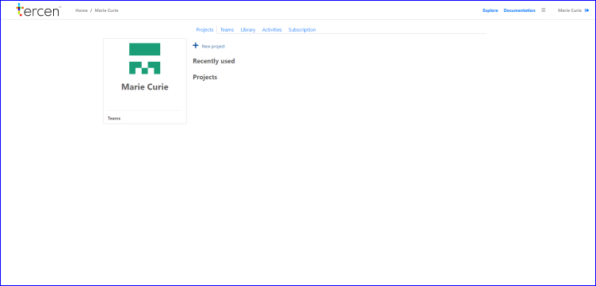
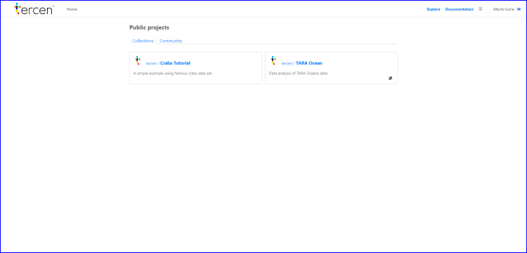

# Explore projects

<<<<<<< HEAD
In this section you explore __Tercen__ public projects. Doing so will copy the uploaded data and workflow.
=======
In this section you explore __Tercen__ public projects. Doing so copies the uploaded data and workflow.
>>>>>>> 51f05425df5e488a0435ce0890df3d652a6b95ff

* Click on `Explore`

* Scroll down to `Tercen/crabs_tutorial`
* Click on `Tercen/crabs_tutorial`

You now see the crabs tutorial project and its files.

In the next section you learn how to  clone a public project.