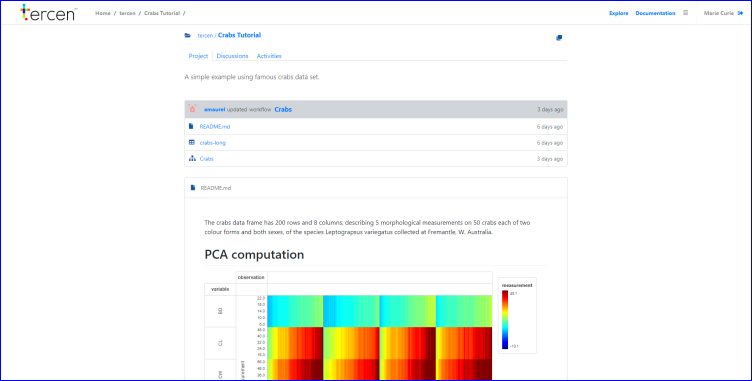
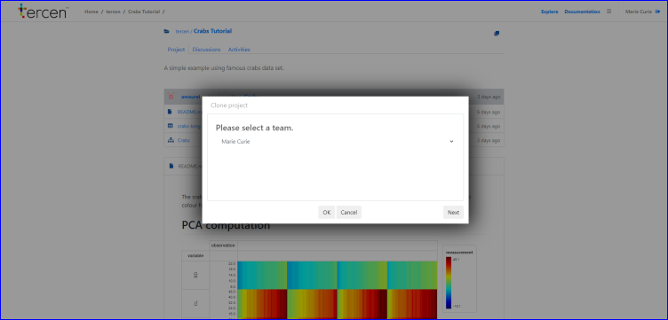

# Cloning a project

In this section we clone (i.e. make a copy) the crabs project from __Tercen public projects__ and place it in your personal team.

* Scroll down to `Tercen/crabs tutorial project`
* Click on `Tercen/crabs tutorial project`

You can now see the chosen crab project and its files.

* The icon for cloning is shown in the top right

* Click on the cloning icon

A popup shows, giving you the option to clone to any team you're in.

* Click `Ok`

You have cloned the project into your personal team.

In the next section you take a look at the cloned Crabs project.