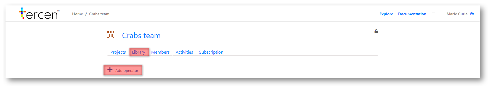
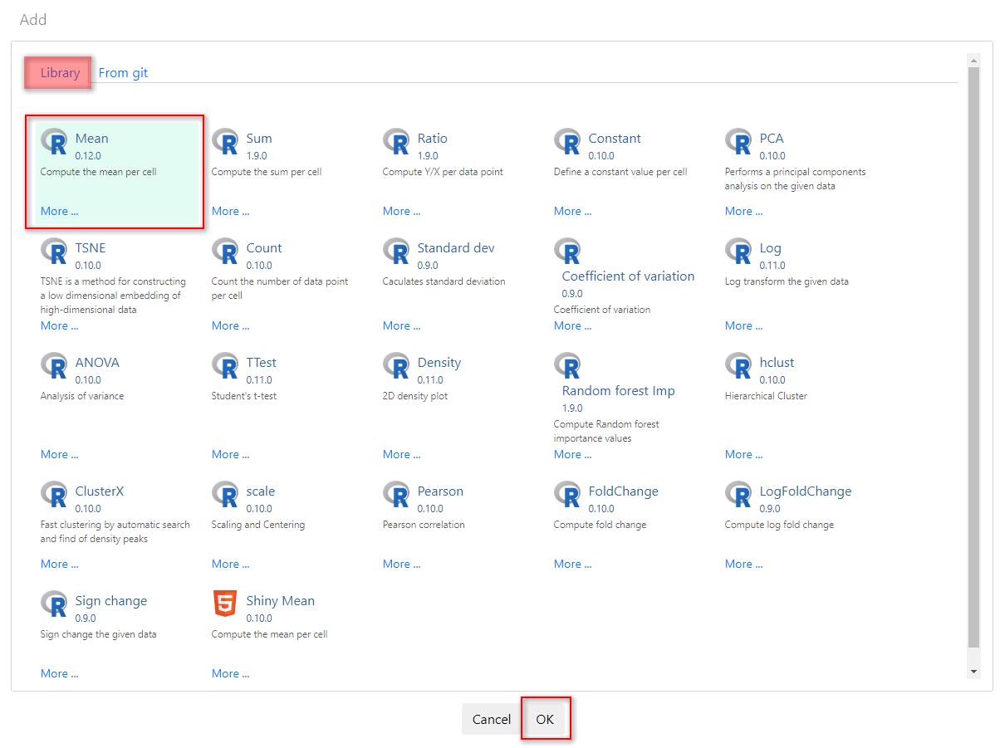

# Add apps to a library

Each personal user, and each team, has a repository of apps called a Library.

\

Apps are the workhorses of a Project and perform the calculations on the data you upload.

\

There are different types of App.

\

__template app__ defines an analysis pipeline to suit a type of research (e.g. RNAseq).\
__workflow app__ a pre-defined set of computations and their visualisations (e.g. a two-group comparison)\
__operator app__ performs a single computation on the data. (e.g. PCA function)\

\

Apps can be added to a teams Library from different sources, such as the public __Tercen app library__ or from private sources such as __GitHub__.

\

How Apps are applied to make computations is discussed int he next Chapter... __Understanding Projects__

\

For a more in-depth discussion of apps, and their uses, you can also refer to the Tercen [__User Manual__](https://tercen.github.io/tercen-book/)

\

__Installing Apps__

\

To install an app to your Library select your personal home page 

\

Or move to a Team Page by clicking the icon

\

Press the `Add operator` button

\

Select the app you want to add. It will turn green.

\

(You can click on the `More` link to read detailed information on this app.)

\

Click the `Ok` button to save your selection.

\

\

__Next...__ understanding how projects work.