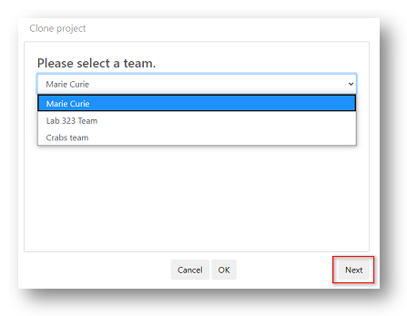

# Understanding projects

Projects are another key concept in __Tercen__, they are the containers where your research is held. 

Projects can be set as private and restricted to you or your team. 

Or they can be made public, which enables collaboration with the wider community. 

* A project is created by a Team.
* Data is uploaded to projects.
* Workflows are attached to projects - to analyse and create visualisations of data.
* Projects hold the record of comments and feedback submitted by your team or community.
* Supporting documents can be uploaded to projects.

In previous sections you learned how to locate your personal projects, and the projects created by your teams. __Tercen__ also provides a platform where Publicly shared projects can be accessed from the cloud.

\

## Explore public projects

To access the __Tercen__ public projects click the `Explore` link in the header bar. 

\

\

You will be taken to the public projects page which is divided into two sections.

\

`Collections` where __Tercen__ displays sponsored research examples

\

`Community` where all the projects made "Public" by their creators appear.

\

## Clone an existing project

Tercen provides two ways to create a project. 

* Create New - A blank project you will add data and workflows to.
* Clone - A copy of an existing project, which you then modify. 

The simplest method for creating a project is to Clone from a pre-existing project. 

Any project can be cloned once you have access.

Personal projects, projects created by your teams and public shared projects, can all be cloned. 

\

Find the project you wish to clone. For example, in the public community.

\

\

Hover your mouse over the project until the `Clone` icon appears. Click it.

\

\

Select whether to copy the project to your personal home page or one of your teams.

\

\

Edit the name and description of your new project and decide if you want to make it publicly available or not.

\

Click `Ok`

This will copy any uploaded data, workflows, and supporting documents contained in the original project. Discussion forum posts and activity histories will not be copied, they are re-set to be blank.

Your new project is now ready for modification.

\

## Create a new project

New Project

Select A Team

Enter Project Description

\

\

Next... working with projects.
