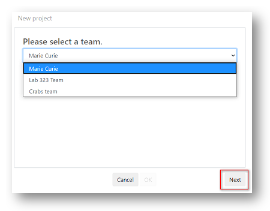

# Understanding projects

Projects are another key concept in __Tercen__, they are the containers where your research is held. 

Projects can be set as "Private" or "Public"

Private projects can only be viewed by you personally or the team that owns it. Private projects can be copied and adjusted only by these people.

Public projects are available to be viewed and collaborated-on by the wider community. They can be copied by anyone to use as a basis for their own research.

* A project is created by a Team.
* Data is uploaded to projects.
* Workflows are attached to projects - to analyse and create visualisations of data.
* Projects hold the record of comments and feedback submitted by your team or community.
* Supporting documents can be uploaded to projects.

In previous sections you learned how to locate your personal and team projects.

__Tercen__ also provides a platform where Publicly shared projects can be accessed from the cloud.

\

## Explore public projects {-}

To access the __Tercen__ public projects click the `Explore` link in the header bar. 

You will be taken to the public projects page which is divided into two sections.

`Collections` is where __Tercen__ displays sponsored research examples

`Community` is where all of the projects made "Public" by their creators appear.

\

\

## Clone an existing project {-}

Tercen provides two ways to create a project. 

* Create New - A blank project you will add data and workflows to.
* Clone - A copy of an existing project, which you then modify. 

The simplest method for creating a project is to Clone from a pre-existing project. 

Any project can be cloned once you have access.

Personal projects, projects created by your teams, and public shared projects can all be cloned. 

\

Find the project you wish to clone. 

For example, in the public community.

\

\

Hover your mouse over the project until the `Clone` icon appears. 

Click on the icon.

\

<left></left>

\

Select the destination of the new project, your personal home page or, one of your teams.

Click the `Next` Button

\

\

Edit the name and description of your new project.

Decide if you want to make it publicly available.

Click the `Ok` Button

\

This will copy any uploaded data, workflows, and supporting documents contained in the original project. 

Discussion forum posts and activity histories will not be copied. They are re-set to be blank.

Your new project is now ready for modification.

\

## Create a new project {-}

You have the option to create a new project from the projects tab of your __personal home page__ or from one of your team pages.

In

Click the `New Project` Button

If you have created a project from your personal page you will be given the option to assign it to your personal page or one of your teams.

\

\

Assign a destination and click the `Next` button to add a description

\

If you create a project from a team page it will be automatically assigned to that team.

You will be prompted to add a description..

\

\

You have created a new project

\

\

\

Next... working with projects.
