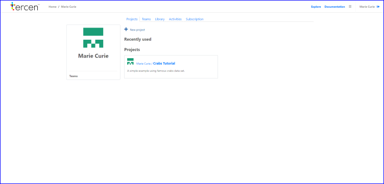
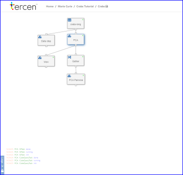
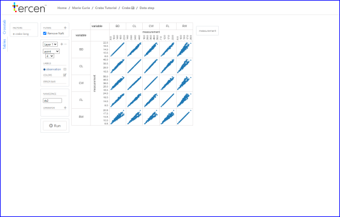

# View the Crabs tutorial

In this section we walk you through the cloned crabs project.

You start off in your personal page.

* Click on `Teams`

\ 

* Click on `Crabs team`

\ 

* Click on `Crabs project`

You are now on the crabs project page and it looks like:

\

it contains the folllowing:

* Project tab
    * Data
    * Workflow
* Discussion tab
* Activity tab

* Click on `Crabs workflow`

\

The workflow is opened and can interact on your data. It will look like the image below:

\

The "crabs_longformat" is preloaded data, containing information about crabs. 
We performed a __PCA__ on the data using one of our __Operators__. We call this a __data step__.

* Doubleclick on `PCA`

\
You see that we visualised the data from the crabs_longformat table using a heatmap.
The __ PCA operator__ is shown on the left.
The data produced by this __data step__ is visualized by adding another __data step__.

* Go back to the workflow main page by clicking on `Crabs workflow`

\

* Click on `PCA results`

On the left side of the __projection__ you see the results of the __PCA__. 

\
We visualized the data using PC1 and PC2, while coloring the species and sex of the crabs.\
Thanks to the drag and drop way of working in __Tercen__ you can quickly and intuitively visualize the results of your data. 

<<<<<<< HEAD
Your data can be visualized in many ways using __Tercen__ and every visualization can provide different insights. Next we will visualize the crabs_longformat using a pair-wise plot. 
=======
Your data can be visualized in many ways using __tercen__ and every visualization can provide different insights. Next you will visualize the crabs_longformat using a pair-wise plot. 

* Click on `Crabs workflow` to go back to the workflow page

>>>>>>> 51f05425df5e488a0435ce0890df3d652a6b95ff

* Click on `Pair-wise plot`

You will see the __projection__ of the __data step__, as seen in the image below.

\
In this __projection__ you see that we visualized the differences between male and female, by coloring by sex.
In the columns you can appreciate that you can add multiple levels, differentiating between the species and the variables.

You now have an idea of the possibilities using __Tercen__. For more information about how to upload and work with your own data, continue reading the getting started guide. 

