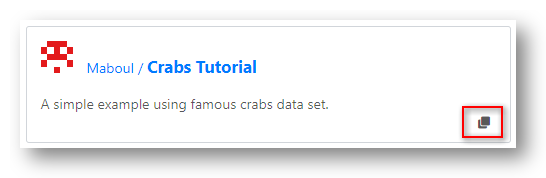
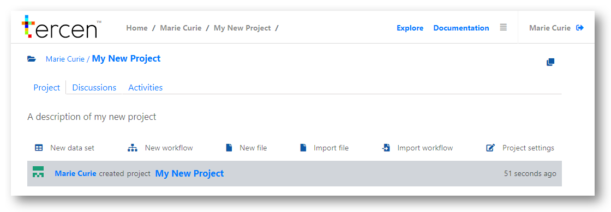

# Understanding projects

Projects are another key concept in __Tercen__, they are the containers where your research is held. 

\

Projects can be set as private or public.

* __Private__ projects can only be viewed by the person or team that owns it. They can be copied and adjusted only by these people.

* __Public__ projects can be viewed and collaborated-on by the wider community. They can be copied by anyone and used as a basis for new research.

\

Projects have the following characteristics.

* A project is created by a Team.
* Data is uploaded to projects.
* Workflows are attached to projects - to analyse and create visualisations of data.
* Projects hold the record of comments and feedback submitted by your team or community.
* Supporting documents can be uploaded to projects.

\

> Re-order - New, explore, clone

## Explore public projects {-}

To access the __Tercen__ public projects click the `Explore` link in the header bar. You will be taken to the public projects page.

\

It is divided into two sections.

* `Collections` is where __Tercen__ displays sponsored research examples

* `Community` is where all of the projects made __Public__ by their creators appear.

\

\

## Clone an existing project {-}

Tercen provides two ways to create a project. 

* __Create New__ - A blank project which you will add data and workflows to.
* __Clone__ - A copy of an existing project, which you then modify. 

\

The simplest method for creating a project is to __Clone__ from a pre-existing project. 

\

Any project can be cloned once you have access to it.

\

Personal projects, projects created by your teams, and public shared projects can all be cloned. 

\

Find the project you wish to clone. For example, in the public community.

\

Hover your mouse over the project until the `Clone` icon appears. 

<left></left>

\

Click the `Clone` icon.

\

Select the destination of the new project, your personal home page or, one of your teams.

\

Click the `Next` Button

\

Edit the name and description of your new project.

Decide if you want to make it publicly available.

\

Click the `Ok` Button

\

Cloning copies the data, workflows, and supporting documents contained in the original project. 

\

Discussion forum posts and activity histories are not copied. These are re-set to be blank.

\

Your new project is now ready for modification.

\

## Create a new project {-}

> Point to the crabs tutorial - has basics of data science

__From your personal home page__

\

\

Click the `New Project` Button

\

Assign the project to an owner. You personally, or a team.

\

\

Click the `Next` button.

\

Add a name and description of your project and choose to make it public or keep it private.

\

\

Click the `Ok` button.

\

__From a Team page__

\

Click the `New Project` Button

\

Projects created this way are automatically assigned to the team.

\

\

Add a name and description of your project and choose to make it public or keep it private.

\

Click `Ok`

\

You have created a new project

\

\

\

__Next...__ working with projects.
