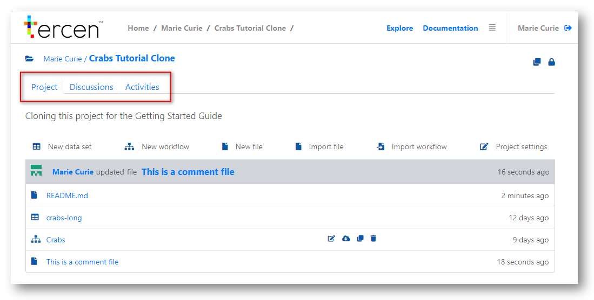
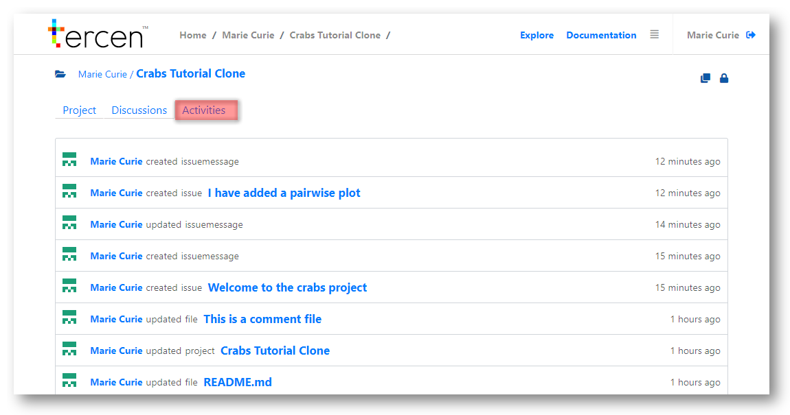
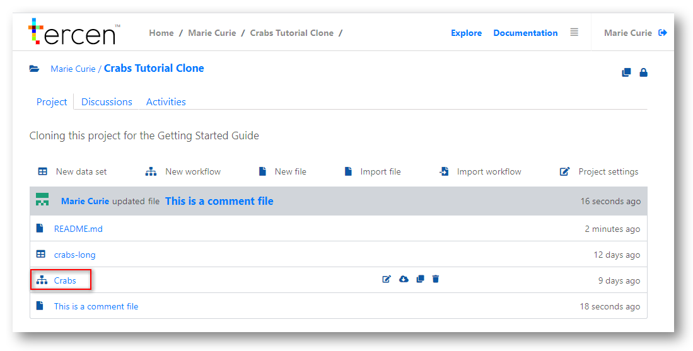
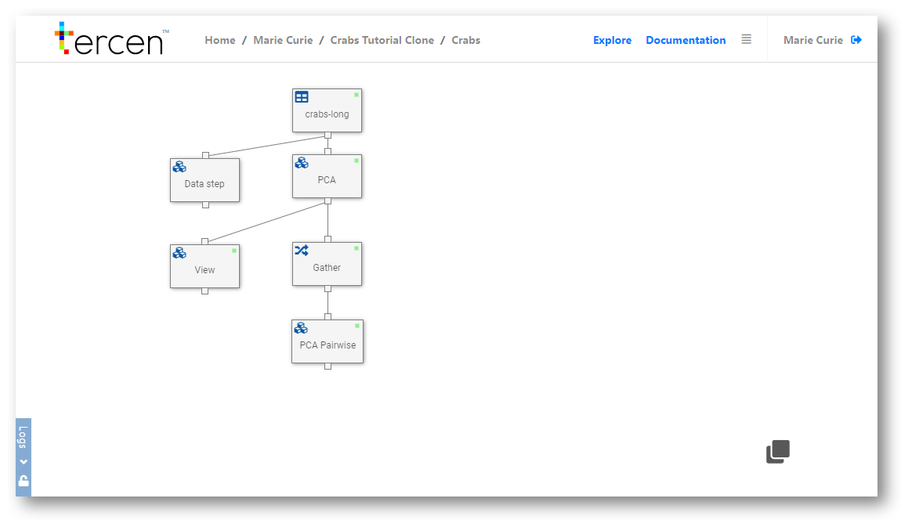
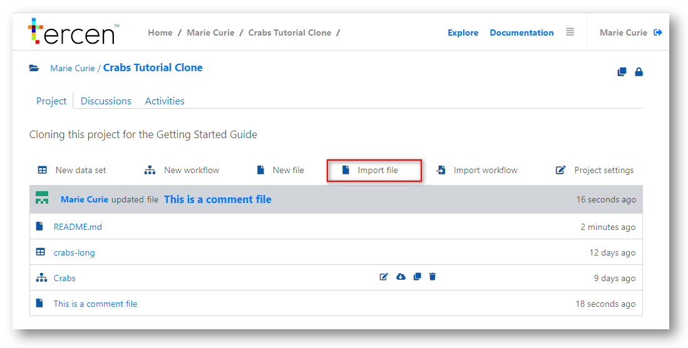

# Working with projects

This section will orientate you to __Tercen__ project screens. 

You will learn the meanings of the icons.

You will be shown how to upload data and create a basic workflow.

\

## Navigating and commenting {-}

Icons exist to perform administrative tasks and to provide visual information about the state of your project.

`Clone`   - This icon allows you to copy the project.\
`Locked`  - Shows that project has not been made public. Only the team can view it.\

\

Hovering your mouse over a project element will make administration icons appear.

`Rename`  - Change the name of the element.\
`Export`  - Export this element. It can then be added to other projects.\
`Clone`   - Projects can have more than one workflow.\   
`Delete`  - Removes the selected element.\

\

A project has three main screens to navigate.

`Project`       - where the main elements of the research are accessed.\
`Discussions`   - Where team members and public users can discuss and comment.\
`Activities`    - A log of the comments and operations performed on the project.\

\

Selecting the Activities tab shows a history of the project.

Comments and changes are recorded here in a decending timeline.

Clicking on a link will bring you to the relevant event.

\

Selecting the Discussions tab shows a forum where feedback in information is shared.

Discussion threads can be created and comments added by anyone with permission to view the project.

\

The Admin of the project can edit and delete all comments.

\

The Project tab contains the main elements of the research project organised in

Functions Bar- The main commands which can be performed on a project.

Latest Activity - The latest action on the project recorded in Activities.

Elements - the files that are attached to the project. They can be documents, data or workflows.

\

## Upload data {-}

Click `New data set` to add a data file

\

\

Give your data a name.

Browse to the location of the data file and select it

__Tercen__ will attempt to detect the type of data file you have added.

\

\

You can over-ride the settings by selecting the following

* Seperator character
* Style used for quotes
* Encoding Type

Latin 1 is the simplest encoding type but does not recognise all possible diacritical marks. 

If you have data in a language with many accent marks encode your data as UTF-8 before uploading.

\

__Tercen__ will attempt to recognise your data and will show you error messages to help debug it.

When your data is recognised __Tercen__ will display a representation of it.

Click the ``Next` button

\

>(I don't know what this is)

\

Click `Ok` to complete the upload of your data

\

## Import and view workflows {-}

Workflows can be imported as a .zip file created by exporting from another project.

\

\

\

Workflows can be created new.

\

\

Worflows can be viewed and edited by clicking on its element link.

\

\

When creating or viewing a workflow you will see the Workflow page

\

For more information on creating and modifying workflows see the next chapter.

\

## Adding Documentation {-}

Documents can be added to a project by writing a text file directly in __Tercen__

\

\

Or uploading a file created in a different program.

\

\

\

Next... Creating and Editing Workflows