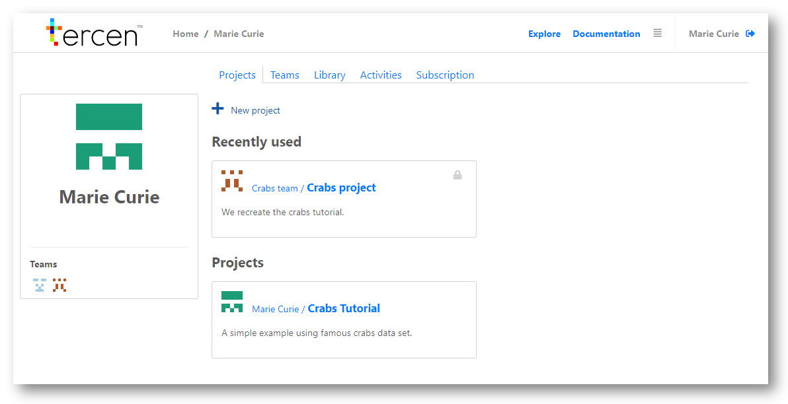

# Create a team
In this section you create a new team in the __tercen__.

Once logged in you see your accounts homepage, similar to the image below.

* Click on `Teams`

\
* Click on `New team`

* Enter your desired team name in `Name`
* Add your teammembers to the team by typing their names in the `Add team members` and clicking `Add`
(Start with your own name)
* Provide them with the right privileges using the dropdown menu 

* Click `OK`

* You will now find your team underneath the `Teams` tab

You have now created a team in __tercen__. The next section will teach you how to create a project for your team to work on.
