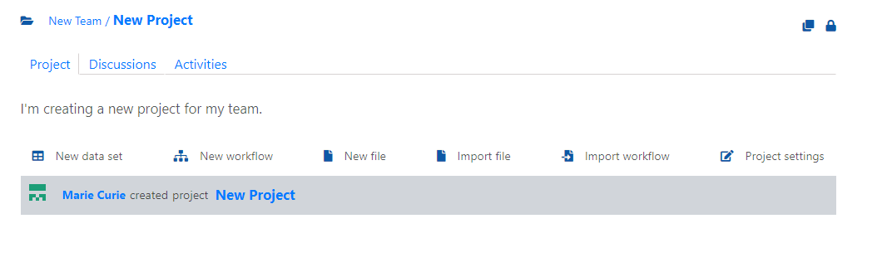

# Create a project
In this section you create a project for your team in __tercen__.

* Head over to your teams by clicking the `Teams` tab

* Click on your New Team

You are now in the New team home page.\
* Click on `New project`

* Enter your desired project name in the `Name`
* Provide a "Project description" in the `Description`

\
* Click `OK`

You are now on the homepage of your new project.
You can observe the tools:

`New data set`  
    `New workflow`  
    `New file`  
    `Import file`  
    `Import a workflow`  

You have now created a new project for your team to work on. In the next section you will install usefull operators for your team to compute your data with.