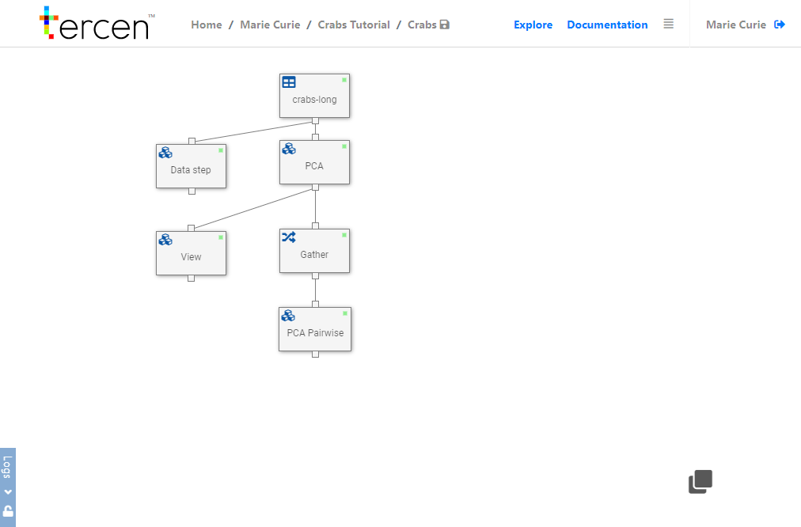

# Understanding workflows

Workflows contain the core functionality of __Tercen__. 

They are the place where computations are performed and visualisations are created from the results.

In this Chapter you will learn how to navigate the workflow building page, identify Data Steps, and view visualisations.

It is not intended for you to be an expert immediately after reading this guide. Further study is recommended before you attempt to create your own workflow. 

A great next step is to complete our tutorial which shows you how to re-create our example Crabs Project.

\

__The Workflow Building Page__

The best way to start getting familiar with workflows is to clone an existing project and examine it. 

\

Browse to __Explore__ and select the __tercen/Crabs Tutorial__ press the `Clone` icon.

\

\

In the elements section click the workflow named `Crabs` to view the workflow builder page.

\

It will look like this.

\

\

__Data Steps and Links__

Workflows are made up of __Data Steps__ (represented by boxes) and __links__ (represented by lines)

They are arranged in a hierarchy where the output of a Data Step forms the input of the Step linked in  the tier below.

Both the calculations made by operators in the Data Step, and the original data, are passed to the next step.

The first step in a workflow is always the Data Table which was created when data was uploaded (see Chapter 9)

\

__Manipulating Data Steps__

Data Steps are added and adjusted by means of two menus activated by right clicking your mouse.

Right clicking on the __white background__ of the builder brings up the short menu.

\

\

* `Save workflow` - Important after a modification to a step or after performing a caluclation
* `Add` - Add a new step which you will  link manually
* `Run All` - Execute all calculations performed by operators in all steps.

\

Right clicking on a __Data Step__ brings up the long menu.

\

\

* `Run/Reset` - Activate or clear the internal calculations performed by this step.
* `Edit` - Open the visualisation page to view and perform calculations
* `Rename` - Change the Data step label
* `Remove` - Delete the Data Step
* `Duplicate` - Copy a Step. The new one is linked in the same tier.  
* `Add` - Add a new step which is linked in the tier below.

\

__Linking__

Steps added from the long menu are linked automatically.

Steps can be linked manually by clicking on nodes.

\

\

__Running__

The Data Step will show a green light when it has performed it's internal calculations and the results are ready to pass to the next tier.

Steps which have been adjusted, reset, or newly added need to be re-calculated.

\

\

__Viewing a Data Visualisation__

Double click on a data step or edit it from the long menu to view the projection made by that step.

You will see the Projection Page.

\

It is divided into sections.

The link bar shows the data being used by this step. 

This included the original table and any re-factored data from previous steps.

\

\

The Factors section shows the groups and variables that are being used. 

They can be the headers from your original data file or groups made by the calculations of a previous data step.

\

\

The filters and visualisations control panel control how your output looks.

\

\

The operators panel allows you to add or change which operator from your library is being applied.

\

You can run and re-set calculations here.

\

\

\

Thank you for reading the __Tercen starters guide__ we hope you have gained enough knowledge to navigate the software and begin to learn how it is used. 

\

\

__Next...__ learn about resources for further training.
