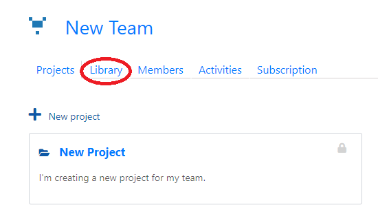
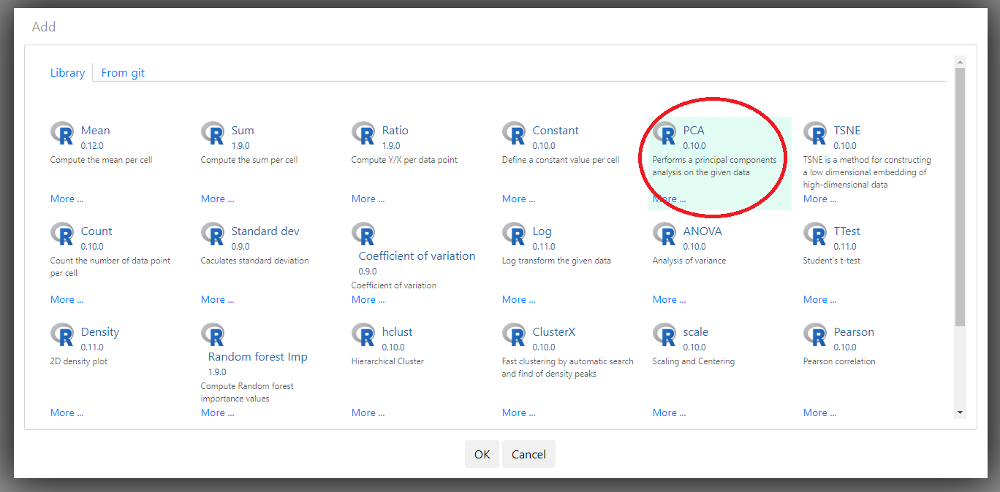
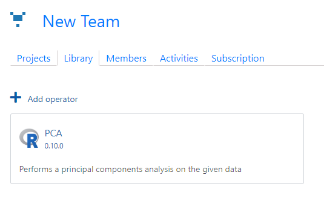

# Install operators

In this section we install operators in __tercen__ for your team to use.

* Go to the team homepage you want to install __operators__ for

* Head over to the `Library` tab

* Click on `Add operator`

A list of operators available on the tercen library will appear.

* Pick the operator of choice

* Click `OK`

* The installed operater will now show in the `Library` tab
* Repeat this process for all other needed operators

You have now installed an operator that can be used by this team. In the next section we will upload the crabs dataset to __tercen__
