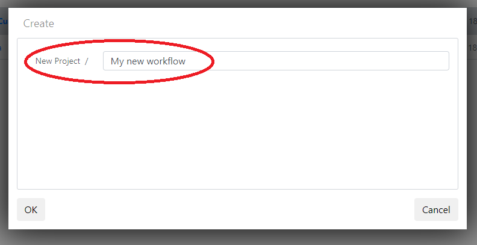
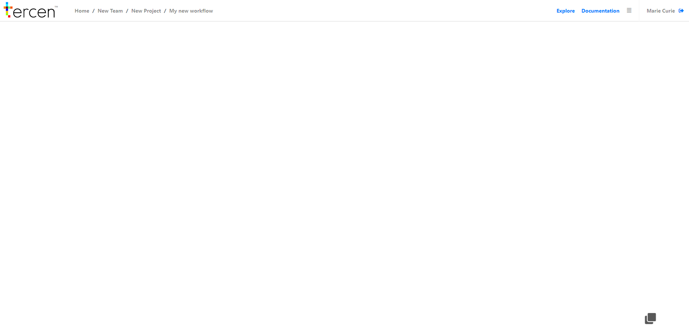

# Create a workflow
In this section you will create a workflow in your project area.

* Go to the project homepage
* Click on `New workflow`

\
* Provide a descriptive name for your new workflow, we will go with "My new workflow"

\

* Click `OK`

You now have an empty __workflow__ titled "My new workflow".

* Right click in the middle of the empty page and select `Add`

* Click on `Table`

\

* Select the data you want to analyse

\

* Click on `OK`

A box will appear in the workflow, we consider each box a __step__ in your data analysis process.
A new step named "Crab data" will appear in your workflow.\

* If the step's name is not correct or descriptive: Select the box, right click and select `Rename`

You have now successfully imported the crabs data set into the projects workflow. In the next section we will view the data using __projections__. 