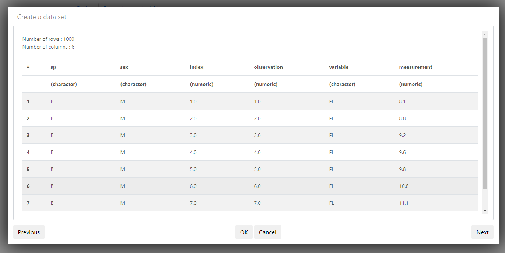
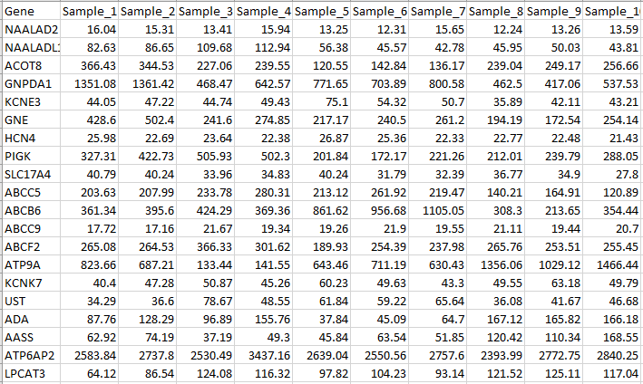

# Upload the data
In this section we upload the crabs dataset to your teams project.

__Tercen__ accepts data in either _.tsv_ or _csv_. The example data set ``crabs_longformat.csv`` is in a _.csv_ format and is in a _long format_. On the bottom of this section we will show the differences between a _long format_ and a _wide format. Also we provide you with the example dataset's download location, which you will use for this guide.

---------------------------------------------------------------------------------------------------------------------------------
The Example dataset:\
The data set for this guide is available online as a git hub repository. 

* Go to the file, by clicking on the following git hub address:

(https://raw.githubusercontent.com/tercen/starters-guide2/master/data/crabs_longformat.csv)

* Once it opens, right click and select `Save as...`

Save your data on your desktop. Use the default name (it should be `crabs_longformat.csv`).

__Crab data description:__

The data set is called "Crabs" and it is in a _long format_. It has a total of 1000 measurements of crab physical traits. It is composed of four groups (two sexes and two species) of 50 measurements for five traits variables, `FL` (frontal lobe size in mm), `RW` (rear width mm), `CL` (carapace length mm), `CW` (carapace width mm) and `BD` (body depth mm). In summary it is:  

Factor|values
------|---
`sp` |species, `B` or `O` for Blue or Orange.
`sex`|`M` or `F`
`index`|index 1 to 50 within each of the four groups, 2 sex and 2 species
`variable`|one of five variables: `FL`, `RW`, `CL`, `CW` and `BD`
`measurement`| the value of one of the five `variable`
`observation`| index 1 to 200 observations for each variable

-----------------------------------------------------------------------------------------------------------------------------------

Navigate to your projects homepage. 

* Click on `New data set`

A dialog window opens which allows you to select the data file's location.

\
* Enter `Crab data` as the name for the data
* Click on `Choose File` and select your file's location (i.e. "C:\\data\\papercrabs_longformat.csv").

Leave the defaults.

* Click `Next`

You will see which column headers were detected and the detected data type.

* Click `Next`

* Click `OK`

You will see the new data set in the projects homepage.

The difference between a _wide format_ and a _long format_:\
In a _long format_ only __one__ measurement is described in a single row, which makes the table very long, hence the name.

\
In a _wide format_ __multiple__ measurements are described in a single row, for example genome data often contains the different samples in the columns.

\

You have successfully uploaded data on to __Tercen__. In the next section you create a workflow for the analysis of the data.