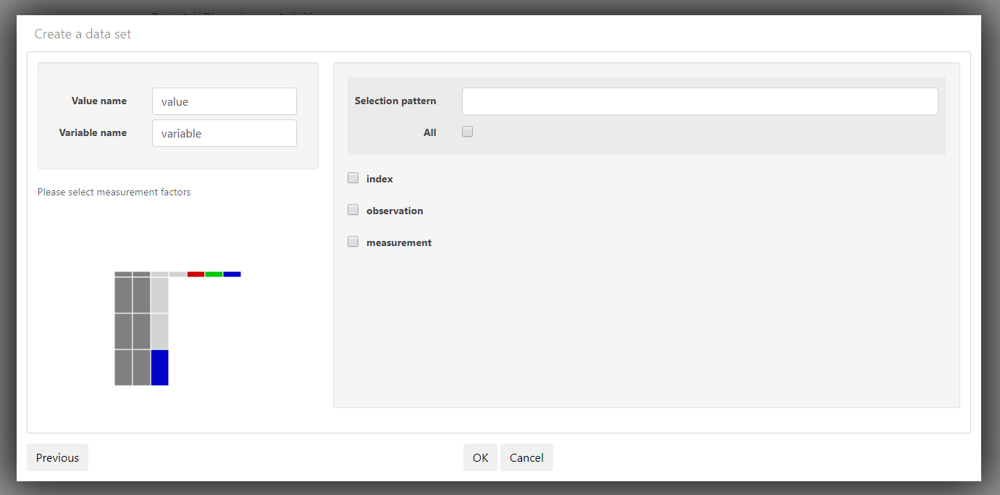

# Upload the Crabs data

In this section you upload a dataset to your teams project.

Go to your projects homepage. 

* Click on `New data set`

Select the data file's location.

\
* Enter a name for the data you want to upload
* Click on `Choose File` and select your file's location

Leave the defaults.

* Click `Next`

You will see which column headers were detected and the detected data type.

* Click `Next`

\

* Click `Ok`

the `crabs_long` is now in the projects homepage.

