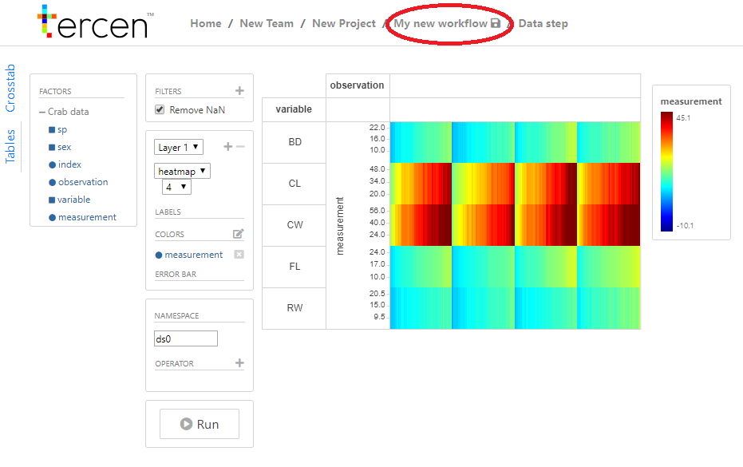

# Define a view

In this section you will create a visual representation of the data using __projections__  on your imported data.

* Right click on the `Crab data` __step__ and select `Add`

* Click on `Data step`

\

A __projection__ page will open, providing many options for visualization of the data.

* Click on + left of the crab data to show a the available factors

  
The __projection__ is composed of different _zones_. The _zones_ descriptions are indicated in the image below

\

You can create any __projection__ of the data by dragging-n-dropping a _factor_ to one of the _zones_. There are four _zones_ to create a table and three on the left to provide details.

On the right are:

* _y-axis zone_
* _x-axis zone_
* _column zone_
* _row zone_

On the left are:

* _label zone_
* _colors zone_
* _error bar zone_
\
\

* Drag-n-drop the ``measurement`` factor to the _y-axis zone_
* Drag-n-drop the ``variable`` factor to the _row zone_
* Drag-n-drop the ``observation`` factor to the _column zone_

The image should look like the one above. Notice, the variable __factor__ is the row and the observations are the columns.

* Resize the image by putting the mouse on the row lines and dragging them closer. Similarly for the columns. \
The image should look like:

\

* Drag-n-drop the "Measurement" __factor__ to _colors zone_
* Select ``heatmap`` in the drop down menu where it currently says "point". 

This menu decides how the datapoints are visualized in the __projection__ 

The projection window should now show the following:

* Save your workflow by clicking on the "save icon" besides the \\My new workflow

You visualized the data for the first time in the  __Tercen cloud__. In the next section we will compute the data to discover new insights.