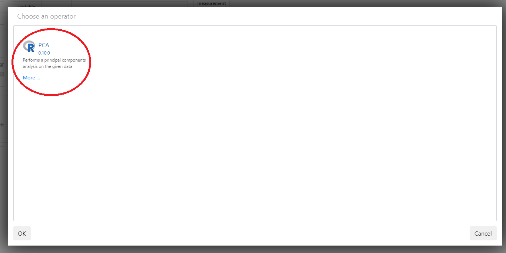

# Running a PCA

In this section we perform a PCA on the data.

The projection you created in the previous section also be used by a computation (i.e. __operator__).

This is due to the _What you see is what you compute_ paradigm. 

First we add the PCA operator.

Continue in the projection we created in the previous chapter.

* Click on the `+` on the right side of the `OPERATOR` tab

* Select  the `PCA` operator

\

* Click on `RUN` to activate the operator

* Click on the save icon beside the `My new workflow` to save the workflow

* Go to the My new workflow page by clicking on it

The data step is now presented:

\

The operators in every step can also be activated from the workflow page by right clicking on the data step and selecting `Run`
The the data step status is indicated by the color on the top right corner, red means not activated and green means activated.

* Right click on the data step and select `Rename`

* Always name the steps descriptive to keep a clear workflow. 
* Rename to "PCA" 

The steps in the workflow can be dragged to your liking. Try to keep your workflow easily interpretable.

* Drag the "PCA" step around

* Save the entire workflow by clicking on the save icon

We have computed a PCA on the data. In the upcoming sections we take a look at the results of the PCA. 