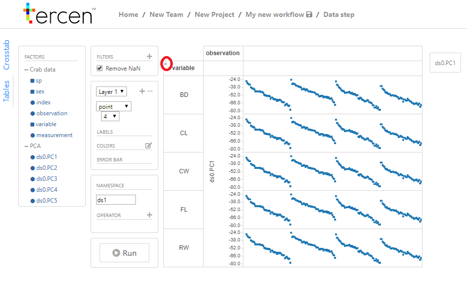
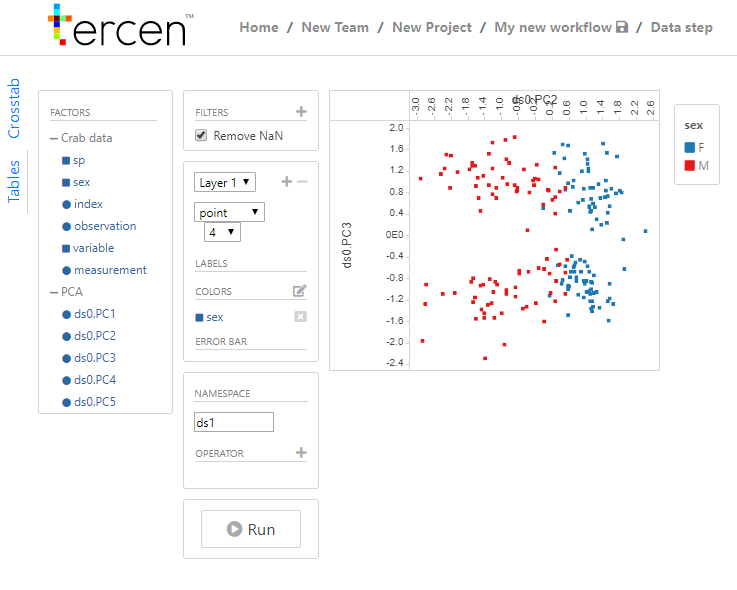
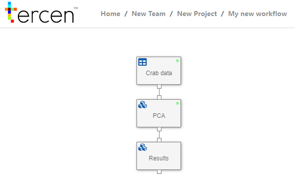

# Visualize PC1 vs. PC2

In this section we visualize the output of your PCA computation. The visualization uses two principal components in a pair-wise plot.

* Right click on the data step "PCA" and select `Add` 

* Select `Data step`

A new projection page opens. 
Looking at the factors on the left of your screen, you will notice there are additional factors in the factor list compared to last section, namely `ds0.PC1`, `ds0.PC2`, etc..

First we require to empty the project by removing factors. Note a tiny x appears when the mouse is placed over the factor zone.

* Hover over the zones

* Click on the `x` to clear the zone, repeat for every zone  

\

The result view should be an empty projection

Now you create the required projection:

* Drag-n-drop the ``ds0.PC2`` factor to the _x-axis zone_
* Drag-n-drop the ``ds0.PC3`` factor to the _y-axis zone_
* Drag-n-drop the ``sex`` and ``sp`` factors to the _colors zone_

\

* Click on `My new workflow`to return to the workflow

* Right click on the Data step and select `Rename`

* Rename it to "Results"

* Save workflow by clicking on the save icon beside the "My new workflow"  

We visualized the crabs data to provide a clear representation, indicating differences between the sexes. In the next section we visualize the data using a multi-group pairwise projection.
