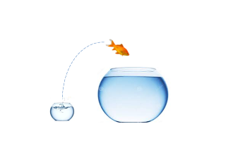

# Introduction

\

There has been an explosion of data in Business and Life Sciences. Not everyone can, or even wants code, but everyone wants to benefit from the wealth of information generated by this revolution.

\

__Tercen__  is the cloud based analytics platform that makes this happen. 

\

We provide simple visual tools that allow a non-programmer to build powerful data-analysis models and sophisticated visualisations.

\

Biologists can explore their data sets unaided and drag-and-drop complex computations together. There's no need to wait for a Bioinformatician.

\

Tercen benefits the Bioinformatician too; computations are standardised through apps and workflows, and day-to-day admin is off-loaded so you can focus on more interesting projects.

\

__Tercen__ promotes open science. It is a platform for scientists to collaborate, share findings, and get feedback. Your project could be cloned to benefit areas far beyond your original scope.
    

\

__Tercen__ helps you to take back control of your data. It empowers you to drive forward with your research. Biologists are empowered. Bioinformaticians… liberated.

\

\

__Next...__ about this guide.
